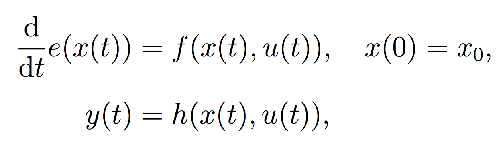

# ANDSM 
Automated Nonlinear Dynamic System Modeling

ANDSM automatically generates nonlinear dynamical models from input-state-output training data
into a state-space format



The generated models are guaranteed passive and optionally incrementally stable.
The passivity property ensures that the models do not generate numerical energy,
hence, suited for modeling nonlinear circuit networks (including active and passive), 
arterial (cardiovascular) networks, and potentially all systems that can be 
represented as circuits or bond graphs.


## Algorithm 

The underlying algorithm is a convex optimization program constrained by specially 
forged sum-of-squares (of-polynomials) constraints. 
These constraints theoretically guarantee that all feasible solutions within
the set preserve desired system properties, such as passivity and incremental stability.
Solving such an optimization problem essentially looks for a model whose
parameters minimize against the training data,
while at the same time every candidate models along the search path
possess the system properties of interest.
 
Details and theories can be referred to [here](https://github.com/yuchsiao/doc/blob/master/thesis_hsiao.pdf).


## Installation and Dependencies

ANDSM utilizes [YALMIP](http://users.isy.liu.se/johanl/yalmip/) to transform SOS optimization problems 
into semidefinite progromming (SDP) problems. 
The resulting SDP problems are then resolved by [MOSEK](https://www.mosek.com/).
The instructions of installing YALMIP, MOSEK, and ANDSM are described [here](INSTALL.md).


## Usage

The basic logic of using ANDSM is 

1. Prepare the training and the validation data sets

2. Create a ANDSM object with the training and the validation sets 

 ```c
 andsm = Andsm(training_data, validation_data);
 ```

3. Train a set of models using different parameters
 
 ```c
 deg_e = 1;
 deg_f = 1;
 deg_h = 1;
 deg_v = 2;
 
 kappa = [1e-4, 1e-3, 1e-2, 1e-1, 1e0, 1e1, 1e2];
 lambda = [1e-7, 1e-6, 1e-5, 1e-4, 1e-3, 1e-2, 1e-1];
 
 andsm.train([deg_e, deg_f, deg_h, deg_v], kappa, lambda);
 ```

4. Take the best model with the lowest errors

 ```matlab
 [model, err, ind] = andsm.get_best_model
 ```

5. Visulize the model performance by simulating it

 ```c
 t = validation_data.t{1};
 u = validation_data.u{1};
 y = validation_data.y{1};
 x0 = [0;0;0];
 tol = 'regular';
 
 [tt, uu, xx, yy] = Andsm.sim(model, t, u, x0, tol);
 ```

6. When satisfied with the accuracy, export the model in SimScape (Simulink) or Verilog-A formats
 
 ```c
 andsm.export('+drc2/drc2_model', 'simscape', 'i', option);
 andsm.export('va/drc2_model_v', 'veriloga', 'v', option);
 ```

7. Now, the generated model is ready for system-level integrations by interconnecting with other models.

**For runnable demos, please refer the [file](andsm_demo.m) for more detailed examples.**
